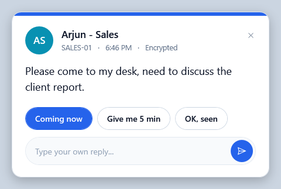
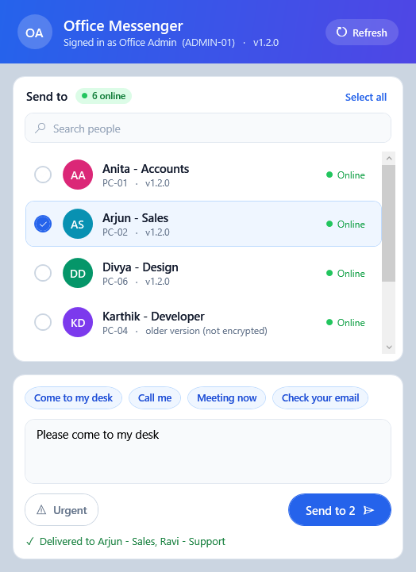
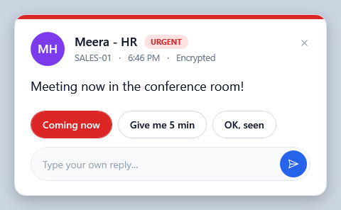
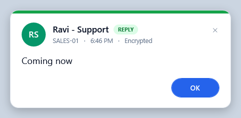

# Office Network Kit

Set up the Windows PCs in an office so they can **see each other on the network** and **send pop-up messages to each other**: no server, no internet, no accounts, nothing to download. One file to run on each PC.

<p align="center">
  
</p>

A manager sends *"Please come to my desk"*. The message pops up on top of everything on that person's screen, and they answer with one click: **Coming now**, **Give me 5 min** or **OK, seen**.

## Features

**Network sharing setup**
- Marks the office network as **Private** (Windows hides PCs on Public networks)
- Turns on **Network Discovery** and **File and Printer Sharing**, for Private networks only
- Optionally gives each PC a clear name (for example `ACCOUNTS-01`)
- Keeps a list of every PC you set up (`office-pcs.csv`)

**Office Messenger**
- Pop-up messages that appear **on top of every window**, with a sound
- **One-click replies**, or type your own
- **Urgent** messages: red pop-up with an alert sound
- Quick messages: *Come to my desk*, *Call me*, *Meeting now*, *Check your email*
- Send to one person, several people or **everyone**
- Shows **who is online**, which **version** each PC runs, and whether each message was **delivered**
- Messages are **encrypted** (AES-256) and **signed with an office key**, so other devices on the network (phones, guests) can neither read them nor send fake pop-ups
- Every message is **addressed to one PC**: if PCs swap IP addresses (for example after a router restart), a message can never pop up on the wrong screen
- **Update notice** when a newer version is running on another office PC or published on GitHub
- Starts with Windows and sits in the system tray; message history; change your display name

**Office status check** (`tools\Check-Office.bat`)
- One table of every PC on the network: messenger running (and which version), file sharing on or off
- Spots PCs set up with a different office key, PCs where the messenger isn't running, and set-up PCs that are switched off
- Read-only, no admin rights needed, no pop-ups on anyone's screen

| Send window | Urgent message | Reply |
|---|---|---|
|  |  |  |

## Requirements

- Windows 10 or Windows 11
- All PCs on the **same office network** (same router; cable or Wi-Fi)
- An administrator account on each PC (to run the setup)

Uses only what is built into Windows: Windows PowerShell 5.1 and WPF.

## Quick start

1. Download **`office-network-kit-vX.Y.zip`** from the [latest release](../../releases/latest) and extract it to a pendrive.
2. On each office PC, double-click **`Setup-This-PC.bat`** and click **Yes**.
3. Confirm the PC is connected to your **office network**, then answer the questions. The setup asks before each part:
   1. **Network sharing**
   2. **Office Messenger**
4. The **first** PC creates a new **office key** (`messenger\messenger-key.txt`) in the kit. **Use the same kit for every other PC**, because PCs with different keys can't message each other.
5. If you renamed a PC, restart it when convenient.

To send a message, click the blue chat icon near the clock (or the *Office Messenger* shortcut on the Desktop), tick people, type and press **Send**.

> **Keep `messenger-key.txt` private.** Anyone with it can read and send messages on your office network. Don't commit it, email it or share it. If it leaks, delete it from the kit, run the setup again on the first PC to create a new key, then re-run it on every other PC.

## Updating

1. Download the new release and **copy your existing `messenger\messenger-key.txt`** (and `office-pcs.csv`) into the new kit.
2. On each PC, run `Setup-This-PC.bat`: answer **n** to network sharing and **Y** to Office Messenger. The display name is kept.

**You don't have to update every PC at once.** Different versions keep working together: a PC on the new version talks to PCs on older versions in the older (unencrypted) format, and encrypts automatically once both sides are updated. `tools\Check-Office.bat` shows which PCs still run an older version.

## How it works

```
Setup-This-PC.bat            run once on each PC (as admin)
 ├─ Part 1: network sharing  Private network profile, firewall rule groups, discovery services
 └─ Part 2: messenger        copy to C:\ProgramData\OfficeMessenger, firewall rule, shortcuts

OfficeMessenger.ps1          runs in the tray for the signed-in user (no console window)
 ├─ who is online            UDP broadcast on port 51515 ("hello?" / "hello" every 60 s / "bye")
 │                           v1.2+ adds "caps=2;ver=x.y.z" so others know it supports encryption
 ├─ messages                 TCP on port 51515, one JSON line; the receiver answers
 │                           OK, NO (rejected) or WRONG (addressed to another PC)
 └─ security                 v1.2+ <-> v1.2+ : AES-256-CBC + HMAC-SHA256 (encrypt-then-MAC),
                                               addressed to one PC name
                             with older PCs  : HMAC-SHA256 signature, text not encrypted
                             always          : timestamp within 15 minutes, duplicate IDs ignored
```

- Encryption and signing keys are **derived from the office key**, so nothing new has to be distributed when updating.
- **Setup** is a `.bat` file so it can be double-clicked. It asks Windows for admin rights, then runs the PowerShell code embedded below its `#PSSTART` marker.
- The **firewall rule** for the messenger only allows port 51515, only for `powershell.exe`, only from the **local subnet** and only on **Private** networks.
- The messenger runs as the **signed-in user**, not as administrator, through `conhost.exe --headless` so no console window appears.

| Location | What |
|---|---|
| `C:\ProgramData\OfficeMessenger\` | Program, office key, `config.json` (display name, settings) |
| `%APPDATA%\OfficeMessenger\history.txt` | Each user's message history |
| Startup folder (all users) | Starts the messenger at sign-in |

**`config.json` settings**

| Setting | Default | Purpose |
|---|---|---|
| `Name` | the PC name | Display name others see |
| `UpdateCheck` | `true` | Once a day, ask GitHub for the latest release. Set to `false` for no internet access at all (other PCs' announcements still tell you about newer versions). |

**Command-line options** for `OfficeMessenger.ps1`:

| Option | Purpose |
|---|---|
| `-Show` | Open the Send window (used by the Desktop shortcut) |
| `-SendTo <ip> -Message "text" [-Urgent]` | Send one message from the command line (format every version understands) |
| `-SendTo <ip> -ToPc <name> -Message "text"` | Same, encrypted and addressed (that PC needs v1.2+) |
| `-Preview <folder>` | Render the windows to PNG files with sample data (used for the screenshots) |

## Security and limitations

Please read this before using it in your office.

| | |
|---|---|
| **Encryption needs v1.2+ on both PCs** | Messages between two v1.2+ PCs are encrypted. Messages to or from a PC still on an older version are only signed, so their text can be read with a packet sniffer. The Send window and pop-ups say which is which. |
| **Names are visible** | Encryption covers the message text. Display names and PC names in messages and online announcements are not encrypted. |
| **Display names aren't verified** | Anyone with the key can choose any display name. The PC name shown under it is the real Windows computer name. |
| **Key readable on each PC** | Any user signed in to an office PC can read the key from `C:\ProgramData\OfficeMessenger`. Intended for offices where staff are trusted. |
| **One network only** | Discovery uses broadcast, which doesn't cross routers, so separate subnets or branches won't see each other. |
| **Clocks** | A PC whose clock is more than 15 minutes off will have its messages rejected. |
| **Replay window** | Seen message IDs are kept in memory only, so a captured message could be replayed to a PC that restarted within the 15-minute window. |
| **Online only** | A PC receives messages only while it is on and someone is signed in. Messages to offline PCs aren't queued. |
| **Update check** | Once a day the messenger asks `api.github.com` for the latest release (no data about you or your office is sent). Turn it off with `"UpdateCheck": false`. |
| **Antivirus** | A hidden PowerShell script listening on the network can trigger some antivirus products. Allow `C:\ProgramData\OfficeMessenger` if needed. |

## Uninstall

- **Messenger:** run `tools\Uninstall-Office-Messenger.bat` on the PC. It removes the program, shortcuts and firewall rules (each user's message history is kept).
- **Network sharing:** turn it off in *Settings → Network & internet → Advanced network settings → Advanced sharing settings*.

## Troubleshooting

Run **`tools\Check-Office.bat`** first: it shows the state of every PC.

| Problem | Fix |
|---|---|
| *"Windows protected your PC"* | Click **More info → Run anyway** |
| *"'powershell' is not recognized"* | Use v1.1 or later of the kit (calls PowerShell by its full path) |
| A console window stays open and closing it stops the messenger | Re-run the setup with v1.1 or later (starts the messenger with no window) |
| A PC isn't in the Send list | Is Office Messenger running there (blue icon near the clock)? Is it on the same network? Click **Refresh**. |
| *"NOT delivered"* | That PC is off, asleep, or nobody is signed in |
| *"address changed, refreshing"* | PCs got new IP addresses (router restart). Wait a moment and send again. |
| Two PCs can't message each other | They were set up with **different office keys** (Check-Office shows *DIFFERENT KEY*). Copy the same `messenger-key.txt` to both kits and re-run the setup. |
| Error about port 51515 | Another program uses that port. Change `$Port` in `Setup-This-PC.bat`, `OfficeMessenger.ps1` and `Check-Office.bat`. |

## License

[MIT](LICENSE) © 2026 Abishek M K
